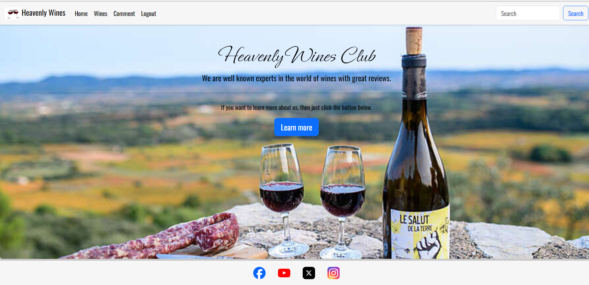
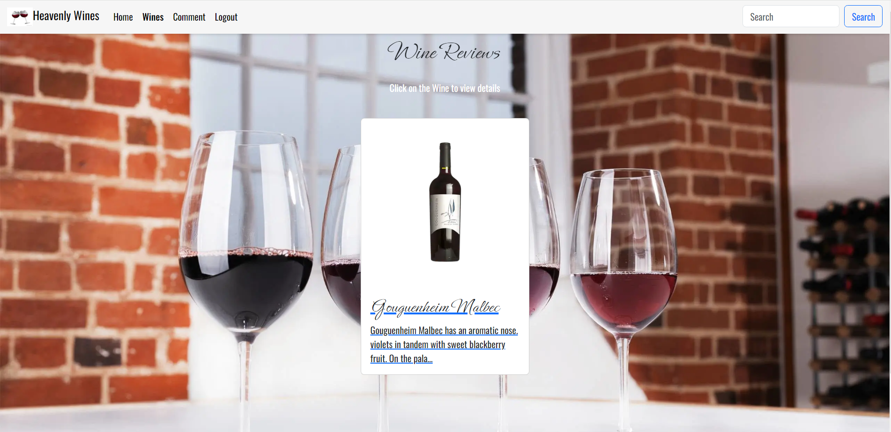
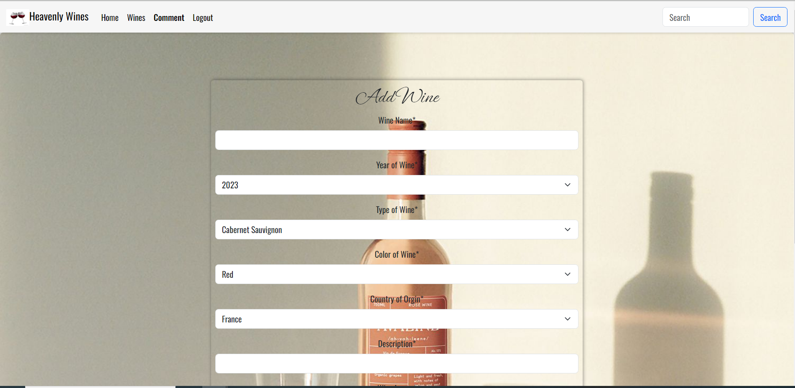

# Heavenly Wines

Heavenly Wines is a wine club where we select three different types of wines each week to be reviewed on the website and leave comments, so you can enjoy this experience from your home. This helps educate the ordinary person to become experts over time in their knowledge of the wines of the world.

# Features

## Site Wide

Header

- Displays the Logo and the name of the brand to be promoted.

  

Navigation Menu

- The navigation is very simple to the website, once you enter your name into the input field and click submit you will be able to enter the website.
- In the home screen there is both a house and restart button that will bring you back to the Introduction Screen.

Footer

- Displays the links to Facebook, Instagram, X and Youtube

  
  

400 Error

- Broken link to page.
- Error due favicon not working.

  

### About Screen

- About Screen Image

  - The user is shown with an introduction of electricity flowing through the screen needed to be Konnect to the game.

- About Screen Description

  - The user is shown a screen with general rules of the game and where to enter the person and submit to enter the game.

    

### Main Screen

- Home Screen Image

  - The user is shown with an image of a electrician coming to Konnect to the game as the electricity flows through the game.

- Home Screen Description

  - The user is displayed with the game as per the game rules shown in the about screen.

    

## Home Page
    
    
## About Page
    
    
## Wines Page
    

## Comment Page
    
    
## Review Page
    

    
# Extra Features

# Future Implementation

# Design

Wireframes - Balsamiq.com

- Home Screen

  

- About Screen

  

- Wines Screen

  

  Comment Screen

  

  Detail Screen

  

  

# Technologies

HTML

- Hypertext Markup Language is the main language to create the structure of the website.

CSS

- Cascading Style Sheets is used to style your content in an external file.

JavaScript

- Object Oriented programming language that interacts with the web browser.

Python

-

Github

- This is used to create and store your source code as a backup if you lose your application.
- <https://github.com/firefox35/heavenly-wines>

Git

- Git is the language used to submit your source code to the repository.

CodeAnyWhere

- Is the application where you create your website in file structures.

Heroku

ElephantSQL

Balsamqi.com

- This application was used to create mockups for the konnect website.
- <https://app.uizard.io>
- <https://app.uizard.io/prototypes/bMqxdZoEyxTYJrG9RKqP>

Website Mockup Generator

- This application was used to create images of the konnect website in desktop, laptop, tablet and mobile devices.
- <https://websitemockupgenerator.com>

Resize images

- This application was used to resize images of the konnect website in desktop, laptop, tablet and mobile devices.
- <https://www.resizepixel.com/>

Navigation

Home Screen

- Submit Button : Once you fill out your first name and click the button it will bring you to the game screen.

Wines Screen

- Home Button : Will bring you back to the Introduction Screen.
- Play Again : Currently will bring you back to the Introduction Screen. (This is a work in progress due to time constraints).

# Testing

Responsiveness

Responsiveness was tested on screen sizes from 320px on Chrome, Edge, Firefox and Opera browsers.

Steps to test:

1. Open browser and navigate to [Heavenly Wines](https://firefox35.github.io/heavenly-wines/)
2. Open the developer tools (right click and inspect)
3. Set to responsive and decrease width to 320px
4. Set the zoom to 50%
5. Click and drag the responsive window to maximum width

Expected:

No issues regards with overlapping, images and links

Result:

No issue to report.

Accessibility

The following criteria were met for testing.

- All navigation links accessibility
- Text or titles descriptions are visible.
- Heading level are not missed.
- HTML page attribute has been set.

Manual testing performed as expected and accessible.

## Lighthouse Testing

### Functional Testing

#### Navigation Links

- Perform testing was carried out on navigation links and found to be working perfectly by the way of clicking each buttons

|   Navigation    |      Page to Load        |
|-----------------|--------------------------|
|  Home Screen    |  index.html              |
|  Wines Screen   |  wines.html              |
|  Comment Screen |  add_wine.html           |
|  Detail Screen  |  wine_detail.html        |
|  Delete Screen  |  wine_confirm_delete.html|
|  Edit Screen    |  edit_wine.html          |

#### Website Testing

-The website was tested to ensure its functionality was correctly working.

-The following test scenarios were covered.

#### TEST 1 - [Heavenly Wines](https://firefox35.github.io/heavenly-wines/)

|          Description        |            Steps                             |          Expected        | Result |
|-----------------------------|----------------------------------------------|--------------------------|--------|
| Store Name in Local Storage | 1. Display of Introduction Screen.           | To submit name into local storage | &check;|
|                             | 2. Enter name in input field.                |                          |        |
|                             | 3. The input field shows the name.           |                          |        |
|                             | 4. Click Submit.                             |                          |        |
|                             | 5. The user is redirected to the Screen.|                          |        |
|                             | 6. The name is stored in local storage.      |                          |        |

#### TEST 2 - [Heavenly Wines](https://firefox35.github.io/heavenly-wines/)

|          Description        |            Steps                             |          Expected        | Result |
|-----------------------------|----------------------------------------------|--------------------------|--------|
| Navigate to Wines Screen    | 1. Displayed on Header of the Home Screen.   | Enter into Wines Screen  | &check;|
|                             | 2. Click on the button called Wines.         |                          |        |
|                             | 3. The user is redirected to the Wines Screen|                          |        |
|                             | 4. The user can view each                    |                          |        |

#### TEST 3 - [Heavenly Wines](https://firefox35.github.io/heavenly-wines/)

|          Description        |            Steps                             |          Expected        | Result |
|-----------------------------|----------------------------------------------|--------------------------|--------|
| User guess word submitted   | 1. In the Screen.                       | Word should display in Output Boxes. | &check;|
|                             | 2. Enter guess word into the Input field.    |                          |        |
|                             | 3. Click Submit.                             |                          |        |
|                             | 4. Display's on Output Boxes.                |                          |        |

#### TEST 4 - [Heavenly Wines](https://firefox35.github.io/heavenly-wines/)

|          Description        |            Steps                             |          Expected        | Result |
|-----------------------------|----------------------------------------------|--------------------------|--------|
| User guess word clears when submitted | 1. In the Screen | Input field to become clear for next guess.| &check;|
|                             | 2. Enter guess word into the Input field.    |                          |        |
|                             | 3. Click Submit                              |                          |        |
|                             | 4. Display's on Output boxes.                |                          |        |
|                             | 5. Input field is empty                      |                          |        |

#### TEST 5 - [Heavenly Wines](https://firefox35.github.io/heavenly-wines/)

|          Description        |            Steps                             |          Expected        | Result |
|-----------------------------|----------------------------------------------|--------------------------|--------|
| The user is shown the result of the guess. | 1. In the  Screen. | Shows the result from the guess | &check;|
|                             | 2. Enter guess word into Input field.        |                          |        |
|                             | 3. Click Submit.                             |                          |        |
|                             | 4. Display's the result from the Output Boxes.|                         |        |

#### TEST 6 - [Heavenly Wines](https://firefox35.github.io/heavenly-wines/)

|          Description        |            Steps                             |          Expected        | Result |
|-----------------------------|----------------------------------------------|--------------------------|--------|
| The results shows the right color scheme | 1. In the Screen.| Display the color scheme in the output boxes.| &check;|
|                             | 2. Enter guess word in the Input field.      |                          |        |
|                             | 3. Click Submit.                             |                          |        |
|                             | 4. A result is displayed on the Output Boxes.|                          |        |
|                             | 5. Result shows colors of the user guess.    |                          |        |

#### TEST 7 - [Heavenly Wines](https://firefox35.github.io/heavenly-wines/)

|          Description        |            Steps                             |          Expected        | Result |
|-----------------------------|----------------------------------------------|--------------------------|--------|
| Random word remains static during guessing the right answer | 1. In the  Screen.| The random word stays static during the game| &check;|
|                             | 2. Enter guess word into the input field.    |                          |        |
|                             | 3. Click Submit.                             |                          |        |
|                             | 4. A result displayed on the output boxes.   |                          |        |
|                             | 5. Enter your next guess.                    |                          |        |
|                             | 6. Click Submit.                             |                          |        |
|                             | 7. Display the same random word again.       |                          |        |
|                             | 8. Process is done a number of times till the user guesses the right word.|      |        |

#### TEST 8 - [Heavenly Wines](https://firefox35.github.io/heavenly-wines/)

|          Description        |            Steps                             |          Expected        | Result |
|-----------------------------|----------------------------------------------|--------------------------|--------|
| Input field can only input a string value. | 1. In the Screen.        |Rejects the integer value.| &check;|
|                             | 2. Enter numbers into the Input Field.       |                          |        |
|                             | 3. Click Submit.                             |                          |        |

#### TEST 9 - [Heavenly Wines](https://firefox35.github.io/heavenly-wines/)

|          Description        |            Steps                             |          Expected        | Result |
|-----------------------------|----------------------------------------------|--------------------------|--------|
| The display outputs the correct result. | 1  In the  Screen.  | Display the correct result of the winner | &check;|
|                             | 2. Enter guess word in the Input field.      |                          |        |
|                             | 3. Click Submit.                             |                          |        |
|                             | 4. Repeat Process till the right answer.     |                          |        |

#### TEST 10 - [Heavenly Wines](https://firefox35.github.io/heavenly-wines/)

|          Description        |            Steps                             |          Expected        | Result |
|-----------------------------|----------------------------------------------|--------------------------|--------|
| Input field can only input a string value | 1. In the Game Screen.         | Rejects the integer value | &check;|
|                             | 2. Enter numbers into the Input Field.       |                          |        |
|                             | 3. Click Submit.                             |                          |        |

#### TEST 11 - [Heavenly Wines](https://firefox35.github.io/heavenly-wines/)

|          Description        |            Steps                             |          Expected        | Result |
|-----------------------------|----------------------------------------------|--------------------------|--------|
| Home Button on  Screen  | 1. In the  Screen.                 | Return to Introduction Screen. | &check;|
|                             | 2. Click on Home Button.                     |                          |        |

#### TEST 12 - [Heavenly Wines](https://firefox35.github.io/heavenly-wines/)

|          Description        |            Steps                             |          Expected        | Result |
|-----------------------------|----------------------------------------------|--------------------------|--------|
| Play Again Button on Screen | 1. In the  Screen.                  |Restart the game again    | &cross;|
|                             | 2. Click on the Play Again Button.           |                          |        |

## Header Icons/Links

Validation Testing

- HTML

  - index.html

    

- CSS

  - bass.css

    

- JAVASCRIPT

  - script.js

   

Unfixed Bugs

- Responsiveness of the website worked on all devices and screen sizes

# Deployment

## Credits

# Websites

Forbidden 403 | CSRF verification failed Request aborted | window 11 | 2022 updated | Django error

- <https://www.youtube.com/watch?v=alcZVag5Zhc>

Django Add Link to Details

- <https://www.w3schools.com/django/django_add_link_details.php>

Django CSRF_TRUSTED_ORIGINS not working as expected

- <https://stackoverflow.com/questions/70508568/django-csrf-trusted-origins-not-working-as-expected>

Heroku Bad Request Server 400 Error

- <https://community.cloudflare.com/t/heroku-bad-request-server-400-error/160887>

How to Fix ModuleNotFoundError No Module Named Error In ...

- <https://www.google.com/search?sca_esv=590295209&rlz=1C1CHBF_enIE1013IE1013&sxsrf=AM9HkKnnzkm3XRvcfG_sBCB0YX_44-Tadw:1702418873346&q=ModuleNotFoundError:+No+module+named+%27wines.forms%27&tbm=vid&source=lnms&sa=X&ved=2ahUKEwiin9HB9IqDAxV-VUEAHSoDCH0Q0pQJegQIDBAB&biw=1360&bih=651&dpr=1#fpstate=ive&vld=cid:206a160d>,vid:OAywo1HbEEc,st:0

Working with forms

- <https://docs.djangoproject.com/en/5.0/topics/forms/>

Improperly Configured(“settings.DATABASES is improperly configured.

- <https://forum.djangoproject.com/t/improperlyconfigured-settings-databases-is-improperly-configured/16870>

Bad Request (400) on heroku - Where to look ?

- <https://www.reddit.com/r/django/comments/2848gb/bad_request_400_on_heroku_where_to_look/?rdt=52833>

CSS styles do not apply correctly on deployed app

- <https://community.fly.io/t/css-styles-do-not-apply-correctly-on-deployed-app/9999>

django.db.migrations.exceptions.InconsistentMigrationHistory

- <https://stackoverflow.com/questions/44651760/django-db-migrations-exceptions-inconsistentmigrationhistory>

django-allauth 0.59.0

- <https://pypi.org/project/django-allauth/>

pip freeze

- <https://pip.pypa.io/en/stable/cli/pip_freeze/>

csrf verification failed. request aborted. Django

- <https://www.google.com/search?q=csrf+verification+failed.+request+aborted.+django&rlz=1C1CHBF_enIE1013IE1013&oq=CSRF+verification+failed.+Request+aborted.&gs_lcrp=EgZjaHJvbWUqDAgBECMYJxiABBiKBTIGCAAQRRg5MgwIARAjGCcYgAQYigUyBwgCEAAYgAQyBwgDEAAYgAQyBwgEEAAYgAQyBwgFEAAYgAQyBwgGEAAYgAQyBggHEEUYQdIBCDIwMDFqMGo3qAIAsAIA&sourceid=chrome&ie=UTF-8>

Django admin login suddenly demanding csrf token

- <https://stackoverflow.com/questions/29573163/django-admin-login-suddenly-demanding-csrf-token>

Bootstrap5 and django?

- <https://forum.djangoproject.com/t/bootstrap5-and-django/23773/5>

Django cannot find static files. Need a second pair of eyes, I'm going crazy

- <https://stackoverflow.com/questions/24199029/django-cannot-find-static-files-need-a-second-pair-of-eyes-im-going-crazy>

Install, uninstall, and upgrade Python packages

- <https://www.jetbrains.com/help/idea/installing-uninstalling-and-upgrading-packages.html>

App model doesn't appear in Django admin in production

- <https://lightrun.com/answers/cookiecutter-cookiecutter-django-app-model-doesnt-appear-in-django-admin-in-production>

django-richtextfield 1.6.1

- <https://pypi.org/project/django-richtextfield/>

How can I deal with this Git warning? "Pulling without specifying how to reconcile divergent branches is discouraged"

- <https://stackoverflow.com/questions/62653114/how-can-i-deal-with-this-git-warning-pulling-without-specifying-how-to-reconci>

# Video’s

Django : You have 3 unapplied migration(s). Your project may not work properly until you apply

- <https://www.youtube.com/watch?v=XgGiE2of2v4>

Python Django Multiple HTML Pages Configure Routing (urls.py)

- <https://www.youtube.com/watch?v=1jcjuV2StxQ>
  
Django Lesson 6: Advanced URL Patterns

- <https://www.youtube.com/watch?v=JJNtrbodjkg>
  