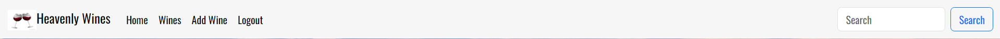
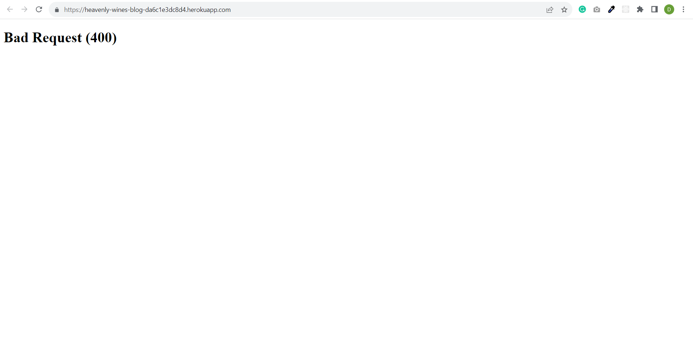
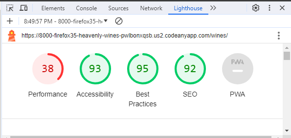

# Heavenly Wines

Heavenly Wines is a wine club where we select three different types of wines each week to be reviewed on the website and leave comments, so you can enjoy this experience from your home. This help's educate a normal person to become experts over time in their knowledge of the wines in the world.

## UX

Database Structure

Database Schema

Models

## UX Design

Overview

Design

- The design is to make it easy for the user to navigate.
- Simplify the website to be user friendly.

Site User

- An expert or a beginner.

Goals for the website

- Is to educate and gain knowlege on different wines.
- To give and gain experience of the type of wines to buy.
- Meet new people along the way.

## Agile Development

Agile Overview

The project is created along side the GITHUB repository to create milestone and issues that are A MUST HAVE in the projects. To keep track of what needs to be implemented within the project, a bit like building blocks along the way with different elements required to have a fully working website.

User stories

A User Story is a piece of functionality the needs to be installed along the way to produce a working website.

1. [USER STORY: Install Django](https://github.com/firefox35/heavenly-wines/issues/1)
2. [USER STORY: Add Apps and Templates](https://github.com/firefox35/heavenly-wines/issues/2)
3. [USER STORY: Install Bootstrap](https://github.com/firefox35/heavenly-wines/issues/3)
4. [USER STORY: Create Header and Footer](https://github.com/firefox35/heavenly-wines/issues/4)
5. [USER STORY: Create Account Registration](https://github.com/firefox35/heavenly-wines/issues/5)
6. [USER STORY: Deploy App to Heroku](<https://github.com/firefox35/heavenly-wines/issues/6>)
7. [USER STORY: Add Wine to Model](https://github.com/firefox35/heavenly-wines/issues/7)
8. [USER STORY: README File Completed](https://github.com/firefox35/heavenly-wines/issues/8)
9. [USER STORY: Add a list view of Wines](https://github.com/firefox35/heavenly-wines/issues/9)
10. [USER STORY: Create a Detail view](https://github.com/firefox35/heavenly-wines/issues/10)
11. [USER STORY: Create a Delete Function](https://github.com/firefox35/heavenly-wines/issues/11)
12. [USER STORY: Edit Wine view](https://github.com/firefox35/heavenly-wines/issues/12)
13. [USER STORY: Add a Search Function to Header](https://github.com/firefox35/heavenly-wines/issues/13)
14. [USER STORY: Styling of the Website](https://github.com/firefox35/heavenly-wines/issues/14)

# Features

User Based Features Implemented

- A user can create an Account.
- A user can add a wine.
- A user can delete a wine.
- A user can edit a wine.
- A user can read the details of the wine.
- A user can delte its account.
- A user can view each screen as a member.

Account Restrictions

- To access the wine list you have to register an account.
- To access the wine details you have to register an account.
- To access the site you must login with username and password.

Website Features

## Site Wide

Header

- Displays the Logo and the name of the brand to be promoted.

  

Navigation Menu

- The navigation is very simple to the website, once you enter your name into the input field and click submit you will be able to enter the website.
- In the home screen there is both a house and restart button that will bring you back to the Introduction Screen.

Footer

- Displays the links to Facebook, Instagram, X and Youtube

  
  
400 Error

- Broken link to page.
- Error was due to a forward slash on a image links.

  

### Home Screen

- Home Screen Image

  - The user is shown with an introduction of a view of the countryside with food, a bottle and two glasses of wine.

- Home Screen Description

  - The user is shown a screen with a brief description of the website with different links on the header and footer to other screens.

    

### About Screen

- About Screen Image

  - The user is shown with an image of wine region in the background.

- About Screen Description

  - The user is shown as title and description of the website with a bottle of wine with the form.The bottle can be click to lead to the description of the wine.

    

## Wines Page

- Wines Screen Image

  - The user is shown with an image with a red bricked wall with a window and four glasses of wine on a table.

- Wines Screen Description

  - The user is shown with a bottle of wine with a description below on card that's happen when you submit the form to add a wine.

## Add Wine Page

- Add Wine Screen Image

  - The user is shown with an image of a pink bottle of wine and a glass on the table with a silhouette that given tranquil setting.

- Add Wine Screen Description

  - The user is displayed with a form to enter a wine on the screen and submit the information.

## Wine Details Page

- Wine Detail Screen Image

  - The user is shown with an image a marble background.

- Wine Detail Screen Description

  - The user is displayed with the a full description of the wine and an image.
  

## Extra Features

- Search Function on the header.
- Social Media Links on the footer.

## Future Implementation

- To incorporate a feature where you can purchaes the wines on the site with a link to payment method.
- Plan to do automated testing.

## Design

Wireframes - Balsamiq.com

- Home Screen

  

- About Screen

  

- Wines Screen

  

- Add Wine Screen

  

- Detail Screen

  

## Technologies

HTML

- Hypertext Markup Language is the main language to create the structure of the website.

CSS

- Cascading Style Sheets is used to style your content in an external file.

JavaScript

- Object Oriented programming language that interacts with the web browser.

Python

- Python is an interpreted, object-oriented, high-level programming language with dynamic semantics.

Django

- Django is a high-level Python web framework that encourages rapid development and clean, pragmatic design.

Github

- This is used to create and store your source code as a backup if you lose your application.
- <https://github.com/firefox35/heavenly-wines>

Git

- Git is the language used to submit your source code to the repository.

CodeAnyWhere

- Is the application where you create your website in file structures.

Heroku

- Heroku is a platform as a service (PaaS) that enables developers to build, run, and operate applications entirely in the cloud.

ElephantSQL

- ElephantSQL is a PostgreSQL database hosting service.

Bootstrap 5

- Its used to style the frontend framework with Django

PostgresSQL

- It is a highly stable database management system

Balsamqi.com

- This application was used to create mockups for the Heavenly Wines website.
  - <https://balsamiq.com/wireframe>

Website Mockup Generator

- This application was used to create images of the Heavenly Wines website in desktop, laptop, tablet and mobile devices.
- <https://websitemockupgenerator.com>

Resize images

- This application was used to resize images of the Heavenly website in desktop, laptop, tablet and mobile devices.
- <https://www.resizepixel.com/>

Navigation

Home Screen

- Home Screen Buttons : They consist on the header the following
  - Home : The home button applies to all website pages to bring you to the home page.
  - Wines : This view shown the reviewed wine card that can be clicked to show the detail of the wine.
  - Comment : The user enters where they can add a review of a wine.
  - Register : Sign up to become a member.
  - Login : Enter User credentials
  - Learn More : This brings you to the about page.

Wines Screen

- The wine shown on the screen once clicked will brings you to the Description of the wine. where you can edit or delete.

# Testing

Responsiveness

Responsiveness was tested on screen sizes from 320px on Chrome, Edge, Firefox and Opera browsers.

Steps to test:

1. Open browser and navigate to [Heavenly Wines](https://firefox35.github.io/heavenly-wines/)
2. Open the developer tools (right click and inspect)
3. Set to responsive and decrease width to 320px
4. Set the zoom to 50%
5. Click and drag the responsive window to maximum width

Expected:

No issues regards with overlapping, images and links

Result:

No issue to report.

Accessibility

The following criteria were met for testing.

- All navigation links accessibility
- Text or titles descriptions are visible.
- Heading level are not missed.
- HTML page attribute has been set.

Manual testing performed as expected and accessible.

## Lighthouse Testing

-index.html

-wines.html

### Functional Testing

#### Navigation Links

- Perform testing was carried out on navigation links and found to be working perfectly by the way of clicking each buttons

|   Navigation    |      Page to Load        |
|-----------------|--------------------------|
|  Home Screen    |  index.html              |
|  Wines Screen   |  wines.html              |
|  Comment Screen |  add_wine.html           |
|  Detail Screen  |  wine_detail.html        |
|  Delete Screen  |  wine_confirm_delete.html|
|  Edit Screen    |  edit_wine.html          |
|  About Screen   |  about.html              |

#### Website Testing

-The website was tested to ensure its functionality was correctly working.

-The following test scenarios were covered.

#### TEST 1 - [Heavenly Wines](https://firefox35.github.io/heavenly-wines/)

|          Description            |            Steps                       |Expected | Result  |
|---------------------------------|----------------------------------------|---------|---------|
| Navigation Links on Home Screen | 1. Wine Screen Button.                 | Passed  | &check; |
|                                 | 2. Comment Screen Button.              | Passed  | &check; |
|                                 | 3. Register Screen Button.             | Passed  | &check; |
|                                 | 4. Login Screen.                       | Passed  | &check; |
|                                 | 5. About Screen (Learn More) Button.   | Passed  | &check; |

#### TEST 2 - [Heavenly Wines](https://firefox35.github.io/heavenly-wines/)

|          Description           |            Steps       |  Expected | Result  |
|--------------------------------|------------------------|-----------|---------|
| Navigate Links to Social Media.| 1. Facebook Link       | Passed    | &check; |
|                                | 2. Instagram Link      | Passed    | &check; |
|                                | 3. Twitter/ X  Link    | Passed    | &check; |
|                                | 4. Youtube Link        | Passed    | &check; |

#### TEST 3 - [Heavenly Wines](https://firefox35.github.io/heavenly-wines/)

|      Description   |       Steps        | Expected | Result  |
|--------------------|--------------------|----------|---------|
| Account Access     | 1. Register a user | Passed   | &check; |
|                    | 2. Login a user    | Passed   | &check; |
|                    | 3. Logout a user   | Passed   | &check; |

#### TEST 4 - [Heavenly Wines](https://firefox35.github.io/heavenly-wines/)

|          Description        |            Steps         | Expected | Result |
|-----------------------------|--------------------------|----------|--------|
| Wine Comment Form Working   | 1. Add Wine              | Passed   | &check;|
|                             | 2. Add Year              | Passed   | &check;|
|                             | 3. Add Type of Wine      | Passed   | &check;|
|                             | 4. Add Colour of Wine    | Passed   | &check;|
|                             | 5. Add Country of Orgin  | Passed   | &check;|
|                             | 6. Add Description       | Passed   | &check;|
|                             | 7. Add Image             | Passed   | &check;|
|                             | 8. Add Image Decription  | Passed   | &check;|
|                             | 9. Click Add Wine Button | Passed   | &check;|

#### TEST 5 - [Heavenly Wines](https://firefox35.github.io/heavenly-wines/)

|          Description             |            Steps            | Expected | Result |
|----------------------------------|-----------------------------|----------|--------|
| The User can remove or edit post | 1. The user can delete post | Passed   | &check;|
|                                  | 2. The user can edit post   | Passed   | &check;|

#### TEST 6 - [Heavenly Wines](https://firefox35.github.io/heavenly-wines/)

|   Description   |              Steps                  | Expected | Result |
|-----------------|-------------------------------------|----------|--------|
| The Search Bar  | 1. The user can use the search bar  | Passed   | &check;|

#### TEST 7 - [Heavenly Wines](https://firefox35.github.io/heavenly-wines/)

|   Description       |            Steps                                                                | Expected | Result |
|---------------------|---------------------------------------------------------------------------------|----------|--------|
| Details of the Wine | 1. The user can click the wine bottle to view the details from the wines screen.| Passed   | &check;|

Validation Testing

- HTML

  - index.html

    

- CSS

  - bass.css

    

- Unfixed Bugs

  - Responsiveness of the website worked on all devices and screen sizes

## Header & Footer Icons/Links

- Logo Image

  - <https://www.vectorstock.com/royalty-free-vector/two-glasses-of-red-wine-clink-vector-8647663>

- Facebook Link
  
  - <https://www.facebook.com/>
  
- Instagram Link
  
  - <https://www.instagram.com/>
  
- X Link
  
  - <https://twitter.com/>

- Youtube Link

  - <https://www.youtube.com/>

# Deployment

To deploy the Heroku:

- Sign up / Log in to Heroku
- From the main Heroku Dashboard page select New.
- Click on Create New App.
- I gave my project a Heavenly Wines.
- Select E.U as the region.
- Click Create app.
- It must be a vaild name of the your app.
- Heroku will create the app.
- It take you to the deploy tab.
- At Deployment Method.
- Click on Github
- At App connected to Github
- Click to search and connect to your repository.
- In the Sttings tab.
- Click on the Config Vars- Reveal Config Vars
- In it add the following config vars
 -CLOUDINARY_URL
 -DATABAE_URL
 -HEROKU_HOSTNAME
 -SECRET_KEY
-paste in the value to each

- In Django create a new file called env.py
- os.environ["DATABASE_URL"]= "Paste the link in here"
- os.environ["SECRET_KEY"] = "your secret key goes here"
- os.environ["CLOUDINARY_URL"] = "paste in the Url copied to the clipboard here"
- In the settings.py file
- Add the following
- import Path from pathlib, import os and import dj_database_url
   os.path.isfile("env.py"): import env
- Add the cloudinary libraries to the list of installed apps in order of important. 
-'Cloudinary_storage' goes above 'django.contrib.staticfiles' and 'cloudinary' goes below it.
- Link the file to the templates directory in Heroku TEMPLATES_DIR = os.path.join(BASE_DIR, 'templates')
- Change the templates directory to TEMPLATES_DIR - 'DIRS': [TEMPLATES_DIR]
- Add Heroku to the ALLOWED_HOSTS list.
- Create Procfile and add the following code - web: guincorn PROJECT_NAME.wsgi
- To the deploy in Heroku go to the Deploy tab and deploy the branch manually.
- Once it has completed the build process it should successfully deploy to view the site live

Version Control

Deployment of Live Version from Github

The website was created using CodeAnyWhere editor and the code was pushed to a repository in GitHub called Heavenly Wines.

I used the following GitHub commands to push the code to the repository, every time a chance is made to the code. This is what they called version control. Its basically a backup version of your code if anything goes wrong.

git add - This command is basically saving your code

git commit -m "Commit Message"

git push

The live link can be found here - <https://firefox35.github.io/heavenly-wines/>

Clone the Repository Code Locally

The site was deployed to GitHub pages. The steps to deploy are as follows:
In the GitHub repository, navigate to the Settings tab
From the menu on left select 'Pages'
From the source section drop-down menu, select the Branch: main
Click 'Save'
A live link will be displayed in a green banner when published successfully.
The live link can be found here - <https://firefox35.github.io/heavenly-wines/>

## Credits

# Websites

Forbidden 403 | CSRF verification failed Request aborted | window 11 | 2022 updated | Django error

- <https://www.youtube.com/watch?v=alcZVag5Zhc>

Django Add Link to Details

- <https://www.w3schools.com/django/django_add_link_details.php>

Django CSRF_TRUSTED_ORIGINS not working as expected

- <https://stackoverflow.com/questions/70508568/django-csrf-trusted-origins-not-working-as-expected>

Heroku Bad Request Server 400 Error

- <https://community.cloudflare.com/t/heroku-bad-request-server-400-error/160887>

How to Fix ModuleNotFoundError No Module Named Error In ...

- <https://www.google.com/search?sca_esv=590295209&rlz=1C1CHBF_enIE1013IE1013&sxsrf=AM9HkKnnzkm3XRvcfG_sBCB0YX_44-Tadw:1702418873346&q=ModuleNotFoundError:+No+module+named+%27wines.forms%27&tbm=vid&source=lnms&sa=X&ved=2ahUKEwiin9HB9IqDAxV-VUEAHSoDCH0Q0pQJegQIDBAB&biw=1360&bih=651&dpr=1#fpstate=ive&vld=cid:206a160d>,vid:OAywo1HbEEc,st:0

Working with forms

- <https://docs.djangoproject.com/en/5.0/topics/forms/>

Improperly Configured(“settings.DATABASES is improperly configured.

- <https://forum.djangoproject.com/t/improperlyconfigured-settings-databases-is-improperly-configured/16870>

Bad Request (400) on heroku - Where to look ?

- <https://www.reddit.com/r/django/comments/2848gb/bad_request_400_on_heroku_where_to_look/?rdt=52833>

CSS styles do not apply correctly on deployed app

- <https://community.fly.io/t/css-styles-do-not-apply-correctly-on-deployed-app/9999>

django.db.migrations.exceptions.InconsistentMigrationHistory

- <https://stackoverflow.com/questions/44651760/django-db-migrations-exceptions-inconsistentmigrationhistory>

django-allauth 0.59.0

- <https://pypi.org/project/django-allauth/>

pip freeze

- <https://pip.pypa.io/en/stable/cli/pip_freeze/>

csrf verification failed. request aborted. Django

- <https://www.google.com/search?q=csrf+verification+failed.+request+aborted.+django&rlz=1C1CHBF_enIE1013IE1013&oq=CSRF+verification+failed.+Request+aborted.&gs_lcrp=EgZjaHJvbWUqDAgBECMYJxiABBiKBTIGCAAQRRg5MgwIARAjGCcYgAQYigUyBwgCEAAYgAQyBwgDEAAYgAQyBwgEEAAYgAQyBwgFEAAYgAQyBwgGEAAYgAQyBggHEEUYQdIBCDIwMDFqMGo3qAIAsAIA&sourceid=chrome&ie=UTF-8>

Django admin login suddenly demanding csrf token

- <https://stackoverflow.com/questions/29573163/django-admin-login-suddenly-demanding-csrf-token>

Bootstrap5 and django?

- <https://forum.djangoproject.com/t/bootstrap5-and-django/23773/5>

Django cannot find static files. Need a second pair of eyes, I'm going crazy

- <https://stackoverflow.com/questions/24199029/django-cannot-find-static-files-need-a-second-pair-of-eyes-im-going-crazy>

Install, uninstall, and upgrade Python packages

- <https://www.jetbrains.com/help/idea/installing-uninstalling-and-upgrading-packages.html>

App model doesn't appear in Django admin in production

- <https://lightrun.com/answers/cookiecutter-cookiecutter-django-app-model-doesnt-appear-in-django-admin-in-production>

django-richtextfield 1.6.1

- <https://pypi.org/project/django-richtextfield/>

How can I deal with this Git warning? "Pulling without specifying how to reconcile divergent branches is discouraged"

- <https://stackoverflow.com/questions/62653114/how-can-i-deal-with-this-git-warning-pulling-without-specifying-how-to-reconci>

# Video’s

Django : You have 3 unapplied migration(s). Your project may not work properly until you apply

- <https://www.youtube.com/watch?v=XgGiE2of2v4>

Python Django Multiple HTML Pages Configure Routing (urls.py)

- <https://www.youtube.com/watch?v=1jcjuV2StxQ>
  
Django Lesson 6: Advanced URL Patterns

- <https://www.youtube.com/watch?v=JJNtrbodjkg>
  